<a id="readme-top"></a>

<!-- PROJECT LOGO -->

<br />
<div align="center">
  <a href="https://github.com/M1KUAPP/Kawan">
    <picture>
      <source media="(prefers-color-scheme: dark)" srcset="docs/readme/banner-dark.png">
      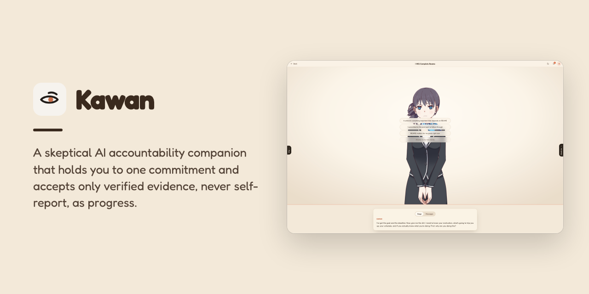
    </picture>
  </a>

  <h3>Kawan</h3>

  <p>
    A skeptical AI accountability companion that holds you to one commitment and accepts only verified evidence, never self-report, as progress.
    <br />
    <a href="https://kawan-frontend.vercel.app"><strong>Live Demo »</strong></a>
    &middot;
    <a href="https://youtu.be/B3u5ByG_-jk">Demo Video</a>
    &middot;
    <a href="https://github.com/M1KUAPP/Kawan/issues/new?labels=bug">Report a Bug</a>
    <br />
  </p>

[![Python][python-badge]][python-url]
[![TypeScript][typescript-badge]][typescript-url]
[![React][react-badge]][react-url]
[![Vite][vite-badge]][vite-url]
[![Live2D][live2d-badge]][live2d-url]
[![FastAPI][fastapi-badge]][fastapi-url]
[![SQLAlchemy][sqlalchemy-badge]][sqlalchemy-url]
[![SQLite][sqlite-badge]][sqlite-url]
[![PostgreSQL][postgresql-badge]][postgresql-url]
[![Supabase][supabase-badge]][supabase-url]
[![Chutes][chutes-badge]][chutes-url]
[![Render][render-badge]][render-url]
[![Vercel][vercel-badge]][vercel-url]
[![uv][uv-badge]][uv-url]
[![pytest][pytest-badge]][pytest-url]

</div>

<!-- TABLE OF CONTENTS -->

## Table of Contents

<details>
  <summary>Expand</summary>
  <ol>
    <li>
      <a href="#about-the-project">About The Project</a>
      <ul>
        <li><a href="#screenshots">Screenshots</a></li>
        <li><a href="#how-it-works">How It Works</a></li>
        <li><a href="#features">Features</a></li>
        <li><a href="#architecture">Architecture</a></li>
        <li><a href="#tech-stack">Tech Stack</a></li>
      </ul>
    </li>
    <li>
      <a href="#getting-started">Getting Started</a>
      <ul>
        <li><a href="#prerequisites">Prerequisites</a></li>
        <li><a href="#installation">Installation</a></li>
      </ul>
    </li>
    <li><a href="#roadmap">Roadmap</a></li>
    <li><a href="#team">Team</a></li>
    <li><a href="#license">License</a></li>
    <li><a href="#acknowledgments">Acknowledgments</a></li>
  </ol>
</details>

<!-- ABOUT THE PROJECT -->

## About The Project

> _"It doesn't believe you. Yet."_

A skeptical accountability companion. Not a cheerleader. One commitment, verified evidence, no self-report. Earn the trust.

Most habit apps take you at your word. Tap a checkbox, keep the streak, lie to yourself for free. **Kawan** _(Malay for "friend")_ is the opposite: a companion that holds you to **one commitment**, asks for **real evidence**, and only believes you once you've shown it.

You commit to a single deliverable with a deadline. Kawan checks in on a schedule, reviews the evidence you submit — a screenshot, a file, or commits in a GitHub repo — and returns a verdict: **pass**, **fail**, or **unclear**. Self-report is never accepted. Trust is earned check-in by check-in.

The catch that makes it work: **Kawan can never change the terms of your deal.** Your goal, deadline, and how you're verified are yours alone. The AI reads them, reasons about them, and nudges you — but it is structurally incapable of editing them. That guarantee is enforced in the schema, not just the prompt (see [The trust boundary](#architecture)).

Built by **Team CHJL** with 💖. Read the [Pitch Deck](kawan/docs/kawan-pitch-deck.pdf) and the [design direction](docs/design.md#1-concept).

Built for [Chutes Hack Malaysia 2026](https://chutes-hack-malaysia-2026.devpost.com/) (Corporate Track), where it placed 1st.

<p align="right"><a href="#readme-top">&uarr;</a></p>

### Screenshots

<table>
  <tr>
    <td width="50%" valign="top" align="left">
      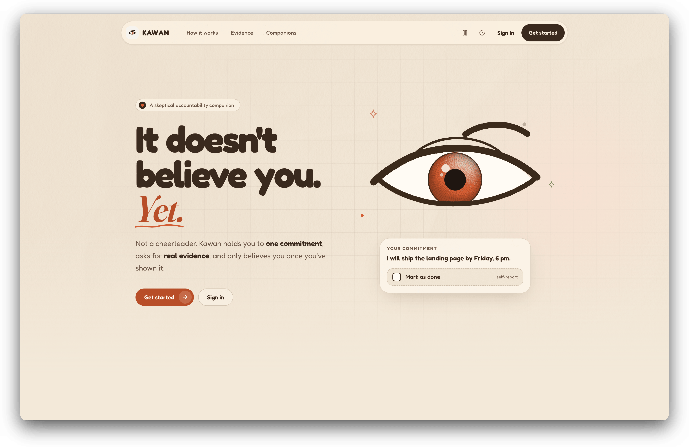
      <br />
      <strong>Landing</strong> · Kawan's pitch: one commitment, verified evidence, and no self-report.
    </td>
    <td width="50%" valign="top" align="left">
      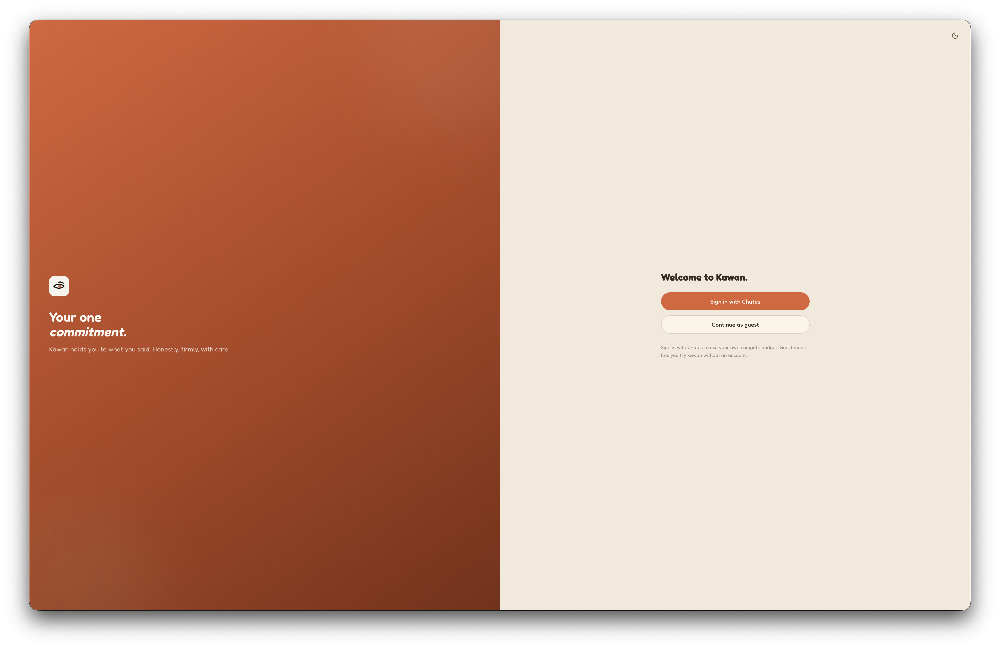
      <br />
      <strong>Sign in</strong> · Sign in with Chutes, or continue as a guest without an account.
    </td>
  </tr>
  <tr>
    <td width="50%" valign="top" align="left">
      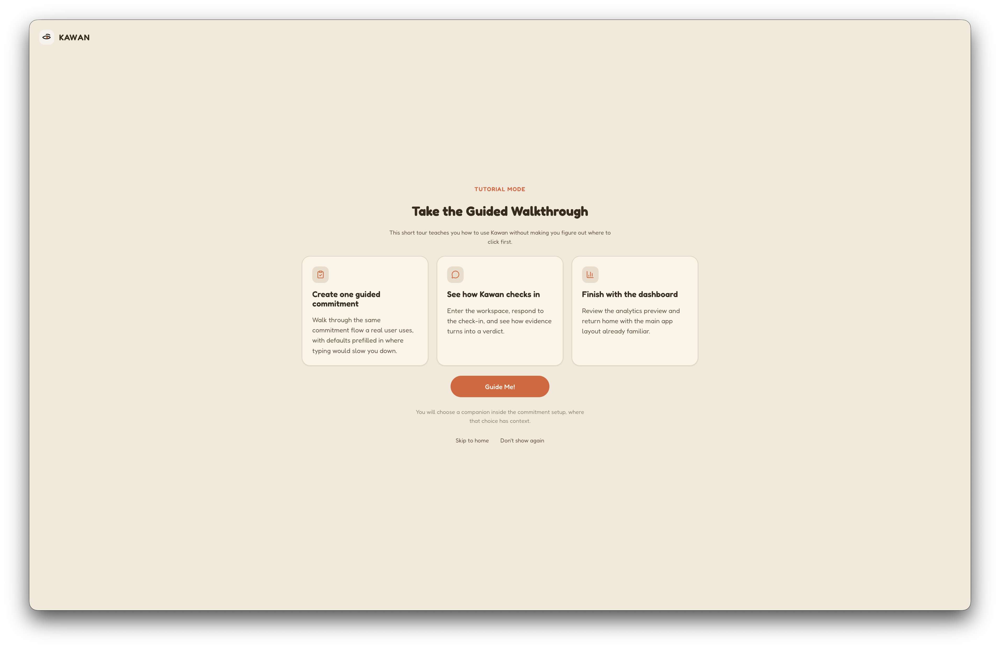
      <br />
      <strong>Guided tour</strong> · An optional tour that teaches the commitment flow on real components.
    </td>
    <td width="50%" valign="top" align="left">
      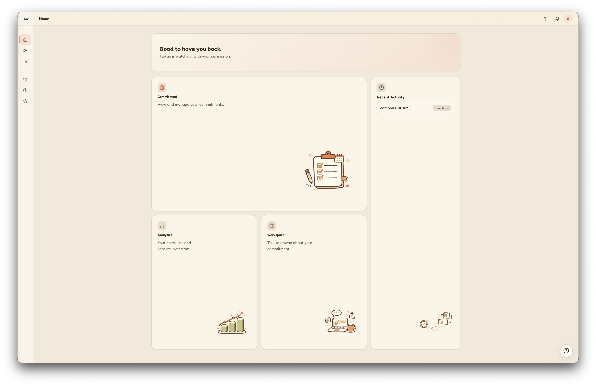
      <br />
      <strong>Home</strong> · The dashboard links your commitments, analytics, workspace and recent activity.
    </td>
  </tr>
  <tr>
    <td width="50%" valign="top" align="left">
      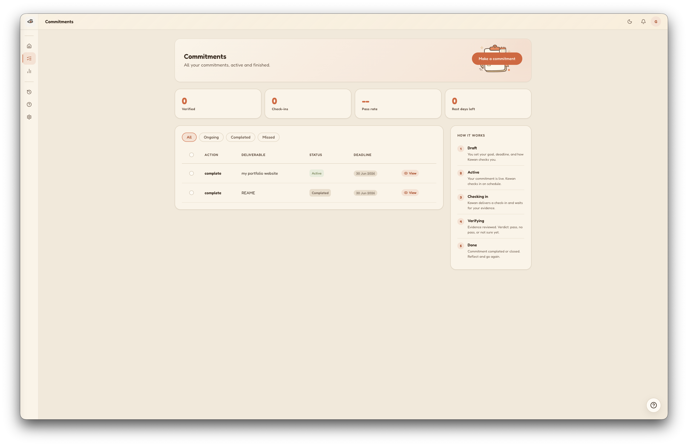
      <br />
      <strong>Commitments</strong> · Every commitment with its deliverable, status and deadline, active or finished.
    </td>
    <td width="50%" valign="top" align="left">
      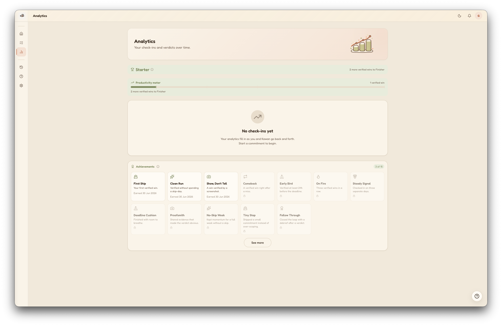
      <br />
      <strong>Analytics</strong> · A productivity meter, identity titles and 15 achievements that reward how you won.
    </td>
  </tr>
</table>

<p align="right"><a href="#readme-top">&uarr;</a></p>

### How It Works

A commitment moves through a single, deterministic lifecycle — from drafting the deal to a verified (or honestly un-verified) outcome.

1. **Compose — state the deal.** `I will [complete] [a deliverable] by [a deadline].` One goal, one deadline. No room to be vague.

   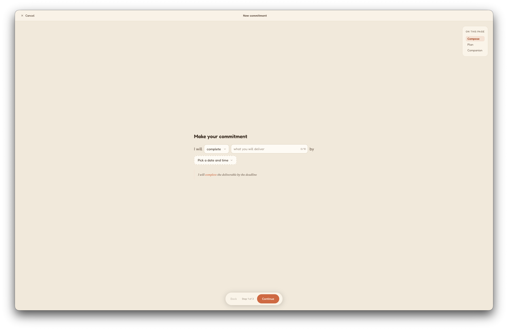

2. **Plan — set the terms.** Choose your evidence source (a GitHub repo to watch, or screenshot/file uploads), optionally name a **witness** who gets emailed if you miss, and a reminder email. _Only you can change these. Kawan reads them but never edits them._

   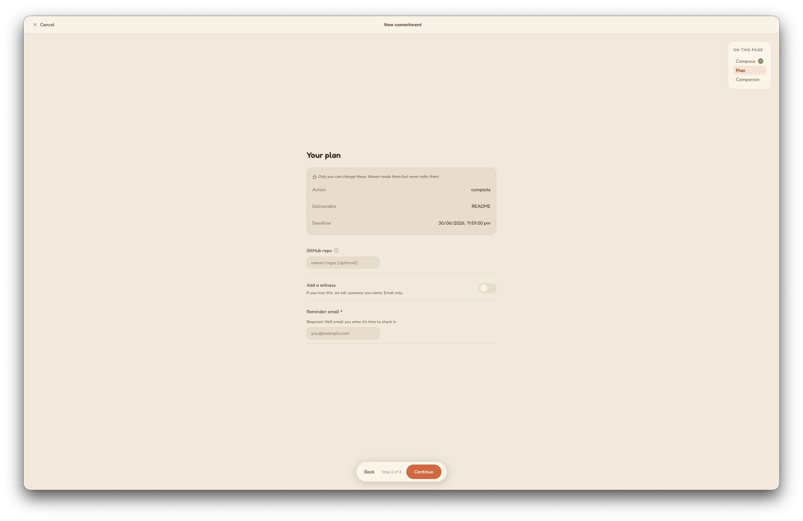

3. **Companion — pick who holds you to it.** Three personalities, same backbone:

   |  Companion   |      Archetype      | Tone                                                            |
   | :----------: | :-----------------: | --------------------------------------------------------------- |
   |  **Kawan**   | Skeptical Concierge | Candid, warm, slightly dry. Believes you because you proved it. |
   |   **Adik**   | Gentle Cheerleader  | Encouraging and kind. Celebrates every step.                    |
   | **Cik Maid** | Playful Taskmaster  | Brisk, playful, expects results — with a wink.                  |

   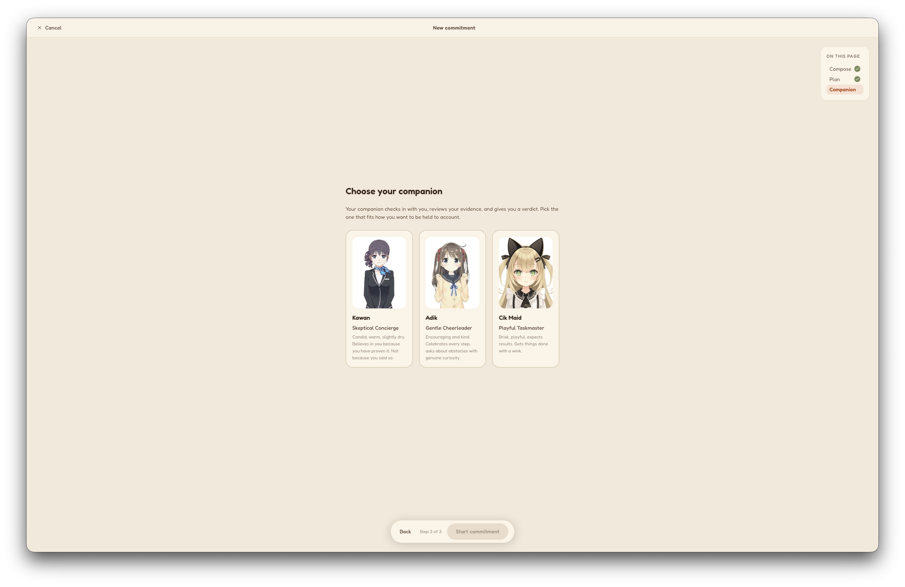

4. **Check in — answer to your companion.** Your companion enters the workspace as a live, animated avatar. It gathers context (why, obstacles, time), then checks in on schedule and waits for evidence.

   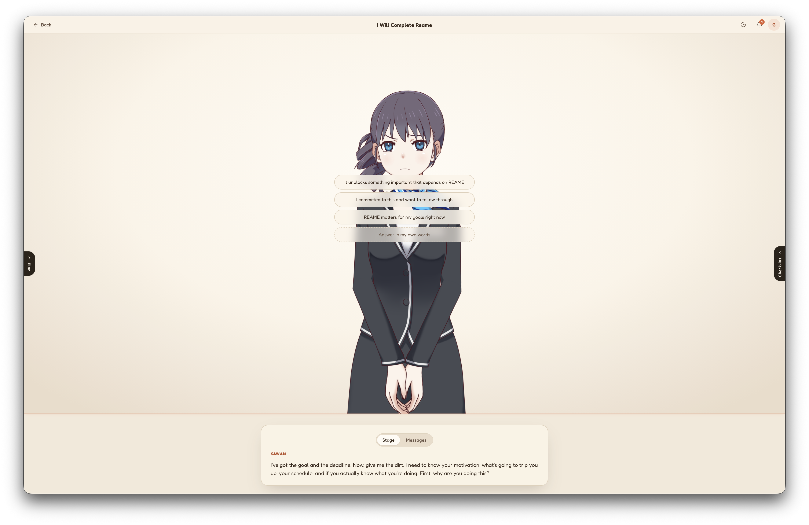

5. **Workspace — context, plan & evidence in one place.** A focused room around the conversation: captured context, an advisory plan, recent activity, a live countdown to the next check-in, and the **Submit final evidence** action.

   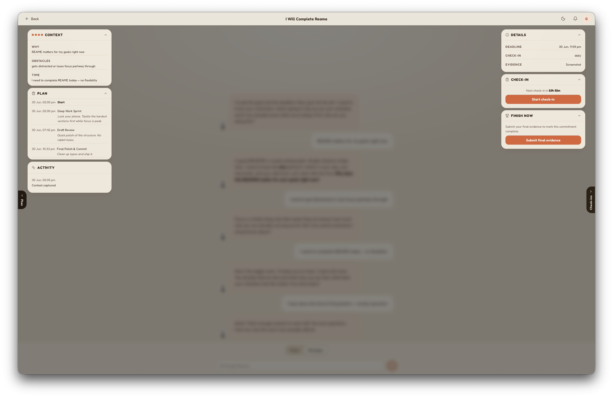

6. **Track — overview, progress & terms.** Every commitment has a detail page: verified count, check-ins, latest verdict and reasoning, the immutable terms, and a full timeline.

   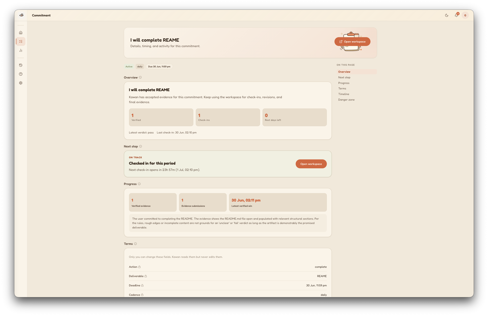

7. **Finish — verified, and only then.** When the evidence passes, the commitment is closed as done. No participation trophies — a win counts because it was shown.

   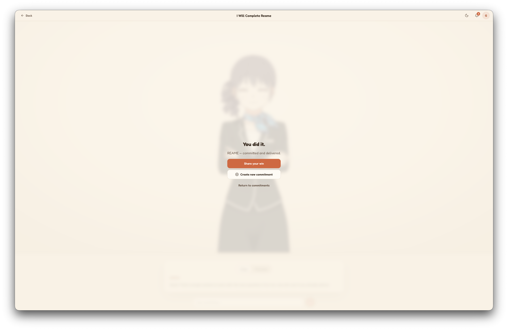

<p align="right"><a href="#readme-top">&uarr;</a></p>

### Features

- 🎯 **One real commitment** — a single action + deliverable + deadline. Hard fields you set and only you can change.
- 🔎 **Evidence over self-report** — verdicts come from a GitHub repo's commits, an uploaded file, or a screenshot judged by a vision model. There is no "mark as done" button you can lie to.
- ⚖️ **Honest verdicts** — every check-in resolves to `pass` / `fail` / `unclear`. `unclear` never punishes; a flaky or slow model degrades to it instead of guessing.
- 🎭 **Three Live2D companions** — Kawan, Adik, and Cik Maid, each a stateless preset of tone + animated model + voice + inference model. Switching the companion changes the messenger, never your commitment.
- 🔐 **TEE inference via Chutes** — real check-in lines and evidence judgments run on Chutes' Trusted Execution Environment chutes, with per-persona model routing and an automatic secondary judge on failure. A deterministic offline **stub** backend runs the whole app with zero keys.
- 🪜 **Reliable delivery** — notifications walk a ladder: live **WebSocket** → **Web Push** → persisted **in-app timeline**, so a check-in is never lost.
- 📣 **Off-device reminders** — opt-in **email** (Resend), **Web Push** (VAPID), and a **Telegram** check-in channel.
- 🤝 **Stakes & witnesses** — name someone who's emailed if you miss the deadline. That's the whole mechanism.
- 📈 **Analytics & achievements** — a productivity meter, identity titles, and 15 behavioral achievements that reward _how_ you won (verified without a skip-day, finished early, came back after a miss…).
- ⏰ **Scheduled & on-demand check-ins** — APScheduler drives the cadence; one code path serves both the cron tick and an instant "check now," and rebuilds its jobs from the DB after a restart.
- 🪶 **Guided walkthrough** — an optional tour that teaches the commitment flow on real components, not a fake demo.
- 🌗 **Polished UX** — light/dark themes, responsive shell, optional Piper neural TTS with a WebSpeech fallback.

<p align="right"><a href="#readme-top">&uarr;</a></p>

### Architecture

<picture>
  <source media="(prefers-color-scheme: dark)" srcset="docs/readme/architecture-dark.svg">
  
</picture>

Kawan is a **single-process FastAPI backend** plus a **React SPA**. The frontend is organized in three zones: public pages (Zone 0), the SaaS shell (Zone 1 — home, commitments, analytics, settings), and the full-screen AI workspace (Zone 2 — the compose flow and live companion).

**The trust boundary.** The core idea is a hard separation between what **you** own and what the **AI** can touch — enforced in the data model, not just convention:

- **Hard fields** (`commitments` table): action, deliverable, deadline, cadence, evidence type, stake. Written only by GUI handlers and the scheduler/verifier. **No AI code path can update them.**
- **Soft context** (`soft_context` table): the _why_, obstacles, and constraints. The **only** table the AI is allowed to write.
- **Proposals**: the AI can _propose_ a change to a hard field, but only **you** can apply it.
- **Audit log**: every hard-field mutation records an actor — and `'ai'` is **unrepresentable** by a database `CHECK` constraint. The AI literally cannot be the author of a change to your deal.

That is why the UI can promise _"Only you can change these. Kawan reads them but never edits them."_ and mean it.

**The check-in pipeline.** One code path (`app/pipeline.py`) runs for both a scheduled cadence tick and an on-demand check:

1. **Fetch** new evidence through the adapter for the commitment's evidence type (`github` / `screenshot` / `file`).
2. **Judge** it into a `Verdict` (`pass` / `fail` / `unclear`) — primary call on a Chutes TEE model, with a bounded timeout that **fails fast to a secondary judge** rather than hanging.
3. **Persist** the evidence, check-in line, and escalation state.
4. **Deliver** down the ladder: **WebSocket → Web Push → in-app timeline**.

A commitment's status machine (`draft → active → verifying → grace → completed / missed`, plus `lapsed` / `returned`) is the only thing that moves state — derived snapshots feed the AI as read-only prompt context and can never write back.

**Project structure.**

```text
kawan/
├── backend/             # FastAPI single-process service
│   ├── app/
│   │   ├── main.py      # app + lifespan (scheduler, telegram poller)
│   │   ├── models.py    # hard fields / soft context / audit log
│   │   ├── pipeline.py  # check-in + final verify (the one code path)
│   │   ├── personas.py  # Kawan / Adik / Cik Maid presets
│   │   ├── adapters/    # github · screenshot · file evidence
│   │   ├── routes/      # auth · commitments · push · telegram · voice · ws
│   │   └── …            # scheduler, chutes client, notify, state machine
│   ├── render.yaml      # Render deploy
│   └── DEPLOY.md        # DB / pooler notes
├── frontend/            # React + Vite SPA
│   ├── src/
│   │   ├── shell/       # Zone 1 — SaaS shell + pages
│   │   ├── zone2/       # Zone 2 — workspace, Live2D, new-commitment flow
│   │   ├── timeline/    # analytics, achievements, productivity meter
│   │   └── …            # auth, notifications, ui, share
│   └── public/          # Live2D models, banner, icons, service worker
├── scripts/             # download_models.sh · download_voices.sh · helpers
└── .env.example         # annotated configuration
docs/readme/             # the images in this README
```

The diagram was made with [archify](https://github.com/tt-a1i/archify) and tinted with Kawan's design tokens.

<p align="right"><a href="#readme-top">&uarr;</a></p>

### Tech Stack

- **Frontend:** React 18 · TypeScript · Vite · React Router v7 · PixiJS v6 + `pixi-live2d-display` · Recharts · Lucide · Biome
- **Backend:** FastAPI · SQLAlchemy 2 (async) · APScheduler · Pydantic Settings · httpx · `uv`
- **Database:** SQLite (dev) · PostgreSQL via Supabase pooler (prod)
- **AI / Inference:** Chutes (OpenAI-compatible TEE inference) + Sign in with Chutes (OAuth2 PKCE) · deterministic stub backend
- **Realtime / Notify:** WebSocket · Web Push (VAPID) · Telegram Bot API · Email (Resend)
- **Avatars / Voice:** Live2D Cubism (Haru, Hiyori, LiveroiD) · Piper neural TTS (optional)
- **Deploy:** Backend on Render · Frontend on Vercel

<p align="right"><a href="#readme-top">&uarr;</a></p>

<!-- GETTING STARTED -->

## Getting Started

The app runs **fully offline out of the box** — the default AI backend is a deterministic stub, so you need no API keys to try it locally.

<p align="right"><a href="#readme-top">&uarr;</a></p>

### Prerequisites

- **Python 3.12+** and [`uv`](https://docs.astral.sh/uv/)
- **[Bun](https://bun.sh/)** (the frontend lockfile is `bun.lock`; npm/pnpm also work)
- A POSIX shell (the asset scripts are bash)

<p align="right"><a href="#readme-top">&uarr;</a></p>

### Installation

Run each block from the repository root.

**1. Configure the environment**

```bash
cp kawan/.env.example kawan/.env  # in the kawan/ folder; sensible dev defaults are pre-filled
```

The dev defaults use local SQLite, the Vite proxy, and `KAWAN_AI_BACKEND=stub`. No secrets required.

**2. Fetch the Live2D companion models** (gitignored; one-time after clone)

```bash
./kawan/scripts/download_models.sh  # Haru + Hiyori auto-download; LiveroiD is a manual BOOTH step
```

**3. Run the backend** (FastAPI on `:8000`)

```bash
cd kawan/backend
uv sync
uv run uvicorn app.main:app --reload
```

**4. Run the frontend** (Vite on `:5173`, proxies `/api` and `/ws` to the backend)

```bash
cd kawan/frontend
bun install
bun dev
```

Open **http://localhost:5173** and choose **Continue as guest** to start.

> **Optional — voices:** run `./kawan/scripts/download_voices.sh` to fetch the three Piper persona voices. Without them, the frontend falls back to the browser's WebSpeech voice.

**Configuration.** All settings use the `KAWAN_` prefix and load from `kawan/.env`. See [`.env.example`](kawan/.env.example) for the fully annotated list. The most important knobs:

| Variable                                    | What it does                                                                      |
| ------------------------------------------- | --------------------------------------------------------------------------------- |
| `KAWAN_AI_BACKEND`                          | `stub` (deterministic, offline — default) or `chutes` (real TEE inference)        |
| `KAWAN_DATABASE_URL`                        | SQLite by default; a Supabase pooler URL in prod                                  |
| `KAWAN_CHUTES_API_KEY`                      | Chutes token — enables guest-mode inference and app registration                  |
| `KAWAN_SIWC_*`                              | Sign in with Chutes (OAuth2 PKCE) client credentials                              |
| `KAWAN_SESSION_SECRET` / `KAWAN_FERNET_KEY` | Cookie signing + token-at-rest encryption (must be set in prod)                   |
| `KAWAN_VAPID_*`                             | Web Push keypair — blank disables push (delivery falls back to the timeline)      |
| `KAWAN_RESEND_API_KEY`                      | Stake/reminder email — blank uses a log-only outbox so the miss path still runs   |
| `KAWAN_TELEGRAM_BOT_TOKEN`                  | Telegram check-in channel — blank makes every send a no-op                        |
| `KAWAN_PIPER_VOICES_DIR`                    | Directory of Piper voice models — blank returns 204 and the client uses WebSpeech |

To use **real inference**, set `KAWAN_AI_BACKEND=chutes` and provide `KAWAN_CHUTES_API_KEY` (and the `KAWAN_SIWC_*` values for Sign in with Chutes).

**Deployment.**

- **Backend → Render.** [`backend/render.yaml`](kawan/backend/render.yaml) defines the web service (`uv sync` → `uvicorn`). Secrets and the cross-origin cookie settings (`KAWAN_COOKIE_SAMESITE=none`, `KAWAN_COOKIE_SECURE=true`) are set in the Render dashboard. Database notes (Supabase session vs. transaction pooler) live in [`backend/DEPLOY.md`](kawan/backend/DEPLOY.md).
- **Frontend → Vercel.** [`frontend/vercel.json`](kawan/frontend/vercel.json) rewrites `/api/*` to the Render backend and serves the SPA. In production the WebSocket connects directly to Render, which is why prod runs `SameSite=None; Secure` cookies.

<p align="right"><a href="#readme-top">&uarr;</a></p>

<!-- ROADMAP -->

## Roadmap

See [open issues](https://github.com/M1KUAPP/Kawan/issues) for a full list of proposed features (and known issues).

<p align="right"><a href="#readme-top">&uarr;</a></p>

<!-- CONTRIBUTING -->

## Team

<a href="https://github.com/M1KUAPP/Kawan/graphs/contributors">
  
</a>

Made with [contrib.rocks](https://contrib.rocks).

<p align="right"><a href="#readme-top">&uarr;</a></p>

<!-- LICENSE -->

## License

See [LICENSE](LICENSE) for more information.

<p align="right"><a href="#readme-top">&uarr;</a></p>

<!-- ACKNOWLEDGMENTS -->

## Acknowledgments

- [Chutes](https://chutes.ai) — Trusted Execution Environment inference and Sign in with Chutes
- [Live2D Cubism](https://www.live2d.com/) & [pixi-live2d-display](https://github.com/guansss/pixi-live2d-display) — the animated companions
- [#LiveroiD](https://booth.pm/en/items/2685284) — the Cik Maid companion model, モデル制作：八城惺架 (@yashiro_seika)
- [Piper](https://github.com/rhasspy/piper) — neural text-to-speech voices
- [Chutes Hack Malaysia 2026](https://chutes-hack-malaysia-2026.devpost.com/) — the hackathon by Nyala Labs, Chutes and Infinity8, where Kawan entered the Corporate Track; its entry is on [Devpost](https://devpost.com/software/kawan).
- [Shields.io](https://shields.io)
- [contrib.rocks](https://contrib.rocks)

<p align="right"><a href="#readme-top">&uarr;</a></p>

<!-- MARKDOWN LINKS & IMAGES -->

[python-badge]: https://img.shields.io/badge/Python-3776AB?style=for-the-badge&logo=python&logoColor=white
[python-url]: https://www.python.org/
[typescript-badge]: https://img.shields.io/badge/TypeScript-3178C6?style=for-the-badge&logo=typescript&logoColor=white
[typescript-url]: https://www.typescriptlang.org/
[react-badge]: https://img.shields.io/badge/React-61DAFB?style=for-the-badge&logo=react&logoColor=black
[react-url]: https://react.dev/
[vite-badge]: https://img.shields.io/badge/Vite-9135FF?style=for-the-badge&logo=vite&logoColor=white
[vite-url]: https://vite.dev/
[live2d-badge]: https://img.shields.io/badge/Live2D-FF6E2D?style=for-the-badge
[live2d-url]: https://www.live2d.com/
[fastapi-badge]: https://img.shields.io/badge/FastAPI-009688?style=for-the-badge&logo=fastapi&logoColor=white
[fastapi-url]: https://fastapi.tiangolo.com/
[sqlalchemy-badge]: https://img.shields.io/badge/SQLAlchemy-D71F00?style=for-the-badge&logo=sqlalchemy&logoColor=white
[sqlalchemy-url]: https://www.sqlalchemy.org/
[sqlite-badge]: https://img.shields.io/badge/SQLite-003B57?style=for-the-badge&logo=sqlite&logoColor=white
[sqlite-url]: https://www.sqlite.org/
[postgresql-badge]: https://img.shields.io/badge/PostgreSQL-4169E1?style=for-the-badge&logo=postgresql&logoColor=white
[postgresql-url]: https://www.postgresql.org/
[supabase-badge]: https://img.shields.io/badge/Supabase-3FCF8E?style=for-the-badge&logo=supabase&logoColor=white
[supabase-url]: https://supabase.com/
[chutes-badge]: https://img.shields.io/badge/Chutes-63D297?style=for-the-badge
[chutes-url]: https://chutes.ai/
[render-badge]: https://img.shields.io/badge/Render-000000?style=for-the-badge&logo=render&logoColor=white
[render-url]: https://render.com/
[vercel-badge]: https://img.shields.io/badge/Vercel-000000?style=for-the-badge&logo=vercel&logoColor=white
[vercel-url]: https://vercel.com/
[uv-badge]: https://img.shields.io/badge/uv-DE5FE9?style=for-the-badge&logo=uv&logoColor=white
[uv-url]: https://docs.astral.sh/uv/
[pytest-badge]: https://img.shields.io/badge/pytest-0A9EDC?style=for-the-badge&logo=pytest&logoColor=white
[pytest-url]: https://docs.pytest.org/
